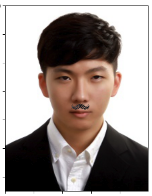
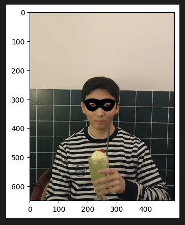

🔑 **PRT(Peer Review Template)**

- [x]  **1. 주어진 문제를 해결하는 완성된 코드가 제출되었나요? (완성도)**
    - 문제에서 요구하는 최종 결과물이 첨부되었는지 확인
        
    - 문제를 해결하는 완성된 코드란 프로젝트 루브릭 3개 중 2개, 
        - 구현 완료되었습니다.
            ```python
            # [custom start]
            # 얼굴감지
            dlib_rects = detector_hog(img_rgb, 1) # rectangles[[(187, 295) (294, 402)]] 

            # 좌표
            print ('마스크이미지의 시작 좌표'f'(x,y) : ({refined_x},{refined_y})')
            # [custom end]
            ```
    퀘스트 문제 요구조건 등을 지칭
        - 해당 조건을 만족하는 부분의 코드 및 결과물을 캡쳐하여 사진으로 첨부

- [x]  **2. 프로젝트에서 핵심적인 부분에 대한 설명이 주석(닥스트링) 및 마크다운 형태로 잘 기록되어있나요? (설명)**
    - [x] 가독성이 좋은 간결한 주석으로 기록되어있습니다.
        ```python
        # 랜드마크의 위치를 저장할 list 생성
        list_landmarks = [] 

        for dlib_rect in dlib_rects:
            points = landmark_predictor(img_rgb, dlib_rect) # 모든 landmark의 위치정보를 points 변수에 저장
            list_points = list(map(lambda p: (p.x, p.y), points.parts())) # 각각의 landmark 위치정보를 (x,y) 형태로 변환하여 list_points 리스트로 저장
            list_landmarks.append(list_points) # list_landmarks에 랜드마크 리스트를 저장

        print('랜드마크 개수:', len(list_landmarks[0]))
        print('[60:67]의 랜드마크:', list_landmarks[0][60:])
        ```
    - [x] 각 실행 스텝에 대한 내용도 상세하게 기록되었습니다.
        ```
        - 0-16: 턱선
        - 17-21: 왼쪽 눈썹
        - 22-26: 오른쪽 눈썹
        - 27-35: 코
        - 36-41: 왼쪽 눈
        - 42-47: 오른쪽 눈
        - 48-60: 입 외곽
        - 61-67: 입 내곽
        ...
        - landmark_predictor: 'RGB이미지'와 'dlib.rectangle'를 입력 받고 'dlib.full_object_detection'를 반환
        - dlib.rectangle: 내부를 예측하는 박스
        - dlib.full_object_detection: 각 구성 요소의 위치와, 이미지 상의 객체의 위치를 나타냄
        ```
    - [x] 여러 태스크를 정의하고 구현했습니다.
        

- [x]  **3. 프로젝트에 대한 회고가 상세히 기록 되어 있나요? (회고, 정리)**
    - [x]  배운 점
        - Dlib 라이브러리에 대해 배운점을 기록해주셨습니다.
    - [x]  아쉬운 점
        - 결과물의 디테일한 부분의 아쉬운 점을 기록해주셨습니다.
    - [x]  느낀 점
        - 사전 훈련 모델 사용에 대한 느낀점을 기록해주셨습니다.
    - [x]  어려웠던 점
        - 스티커 이미지 적용 시 구체적인 구현 방법에 대한 점을 기록해주셨습니다.