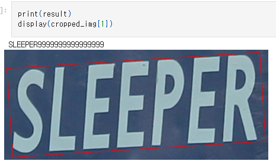
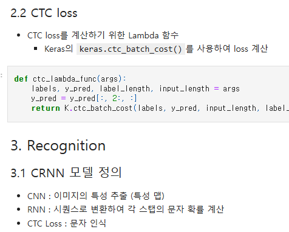
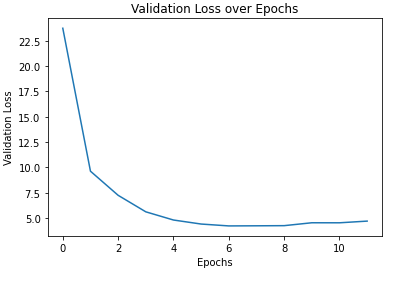
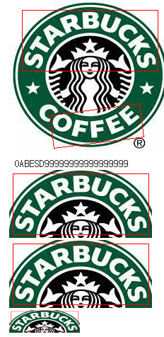
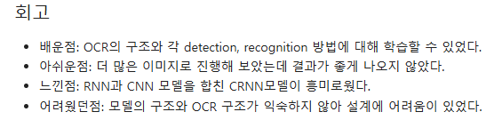

🔑 **PRT(Peer Review Template)**

- 코드 : 이경규
- 리뷰어 : 이얼

- [YES]  **1. 주어진 문제를 해결하는 완성된 코드가 제출되었나요? (완성도)**
    - 문제에서 요구하는 최종 결과물이 첨부되었는지 확인
    - 문제를 해결하는 완성된 코드란 프로젝트 루브릭 3개 중 2개, 
    퀘스트 문제 요구조건 등을 지칭
        - 해당 조건을 만족하는 부분의 코드 및 결과물을 캡쳐하여 사진으로 첨부

리뷰어 : 샘플 이미지 + CRNN모델을 사용하여 OCR 결과를 출력하였으며, 문자를 정확하게 맞춤

- [YES]  **2. 프로젝트에서 핵심적인 부분에 대한 설명이 주석(닥스트링) 및 마크다운 형태로 잘 기록되어있나요? (설명)**
    - [YES]  모델 선정 이유
    - [YES]  Metrics 선정 이유
    - [YES]  Loss 선정 이유

리뷰어 : 주석을 남기고, 코드를 설명해주실때 선정 이유를 말씀해주셨음

- [YES]  **3. 체크리스트에 해당하는 항목들을 모두 수행하였나요? (문제 해결)**
    - [YES]  데이터를 분할하여 프로젝트를 진행했나요? (train, validation, test 데이터로 구분)
    - [YES]  하이퍼파라미터를 변경해가며 여러 시도를 했나요? (learning rate, dropout rate, unit, batch size, epoch 등)
    - [YES]  각 실험을 시각화하여 비교하였나요?
    - [YES]  모든 실험 결과가 기록되었나요?

리뷰어 : 실험 결과를 기록하고, loss가 안정적으로 수렴하는 것을 확인하였음, 다양한 실험을 진행하고 결과를 확인하였음 

- [YES]  **4. 프로젝트에 대한 회고가 상세히 기록 되어 있나요? (회고, 정리)**
    - [YES]  배운 점
    - [YES]  아쉬운 점
    - [YES]  느낀 점
    - [YES]  어려웠던 점

리뷰어 : 회고를 남기고, 실험을 진행하며 아쉬웠던 점 (STOP)을 왜 인식하지 못했을지를 고민하신 것도 공유해주셨습니다.
